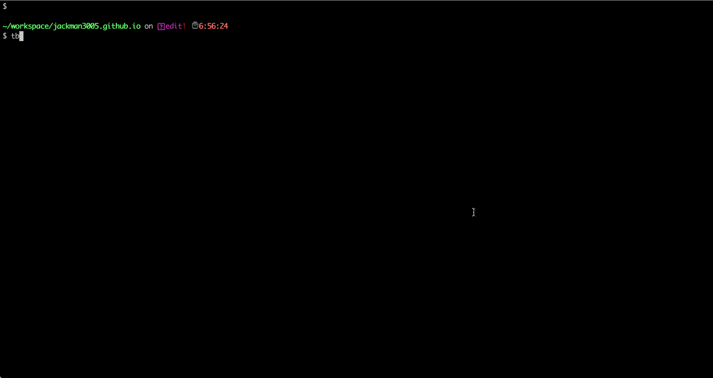

# Task Basher
This is a utility program that assists you in running tasks from the terminal.




## Features
- Tasks are run from within your native terminal environment
- Kills tasks using `Ctrl + C`
- One button restart of long running tasks
- All task output is captured and placed back in original calling terminal


## Requirements
- [Python 3](https://docs.python-guide.org/starting/installation/)
- [Tmux](https://hackernoon.com/a-gentle-introduction-to-tmux-8d784c404340)


## Future Work

- Adjust control pane contents and size based on available window size
```
tmux display -p -t RUNNER__2018-08-19_00-17-18:.1 '#{window_width}x#{window_height}'
```
- Use Urwid to display contents of control pane